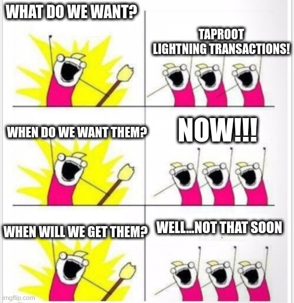

# Lightning Is Getting Taprooty Scriptless-Scripty

This article contains a summary of the many changes that Taproot will bring to lightning.
But first of all, a disclaimer:



While Taproot brings many privacy improvements to the table, there are a lot of other, unrelated
updates to lightning that are higher priority and orthogonal to it, and implementers are already
struggling to find time to review and implement everything. Please be patient, Taproot is coming,
but it will take time!

Schnorr, Musig2 and adaptor signatures have been covered in [this article](./schnorr.md): they are
the foundations upon which we'll build everything, so I suggest reading it if you want to
understand the low-level details of the following proposals.

Now that this is out of the way, let's dive into Taproot stuff.

## Table of Contents

* [Musig2 Channel Funding](#musig2-channel-funding)
* [Taproot Lightning Transactions](#taproot-lightning-transactions)
* [Point Time-Locked Contracts](#point-time-locked-contracts)
* [Further Changes](#further-changes)
* [Resources](#resources)

## Musig2 Channel Funding

Thanks to Schnorr and Musig2, we can make lightning channels indistinguishable from any other key
path spend in the cooperative case.

The funding transaction output will be a taproot output without a script path, where the
`internal_pubkey` is the Musig2 aggregated public key of the two channel participants.

We need to add Musig2 nonces to existing messages (in the `extension` tlv stream) but don't need to
define any new message. For example, when updating a commitment, `revoke_and_ack` will contain the
next set of nonces and `commit_sig` will contain the current nonces and the (partial) signature.

Changing the funding output is a good opportunity to also introduce xpubs. Instead of directly
exchanging a `funding_pubkey` when opening the channel, participants exchange a `funding_xpub`
and then derive the actual `funding_pubkey` with non-hardened derivation. Future updates of the
funding output (e.g. splicing funds in or out) can simply increment a derivation counter, which
removes the need to explicitly share the next funding pubkeys and simplifies backup. This idea was
proposed in [ajtowns' mailing list post](https://lists.linuxfoundation.org/pipermail/lightning-dev/2021-October/003278.html).

This change is quite simple and can be added relatively quickly (once Musig2 has been finalized).

## Taproot Lightning Transactions

The existing transaction structure (detailed in [this article](./lightning-txs.md)) can be updated
to use Taproot scripts.

This doesn't change the protocol: nodes still exchange the same messages when sending payments
(`update_add_htlc`, `commit_sig`, `revoke_and_ack`, `update_fulfill_htlc`, `update_fail_htlc`).

We simply take the existing scripts and split them into several branches of a taproot tree,
leveraging the key path spend whenever it makes sense.

The commitment transaction will then become:

```text
{
  "version": 2,
  "locktime": 543210000,
  "vin": [
    {
      "txid": "...",
      "vout": ...,
      "scriptSig": "<signature for musig2(pubkey1, pubkey2)>",
      "sequence": 2500123456
    }
  ],
  "vout": [
    {
      "value": 0.5,
      "output_type": "to_local",
      "scriptPubKey": {
          "internal_pubkey": "
            # funds go to the remote node with the revocation key
            musig2(<revocationpubkey>,<remote_pubkey>)
          ",
          "tapleaf": "
            # or back to us after a relative delay (<to_self_delay>)
            <local_delayedpubkey>
            OP_CHECKSIGVERIFY
            <to_self_delay>
            OP_CHECKSEQUENCEVERIFY
          "
      }
    },
    {
      "value": 0.3,
      "output_type": "to_remote",
      "scriptPubKey": {
          "internal_pubkey": "<unused_nums_point>",
          "tapleaf": "
            # funds go back to the other channel participant after 1 block
            <remote_pubkey>
            OP_CHECKSIGVERIFY
            1 OP_CHECKSEQUENCEVERIFY
          "
      }
    },
    {
      "value": 0.00000330,
      "output_type": "local_anchor",
      "scriptPubKey": {
          "internal_pubkey": "<local_delayedpubkey>",
          "tapleaf": "
            # after a relative timelock of 16 blocks, anyone can claim this tiny amount
            # once the to_local output has been spent, revealing the local_delayedpubkey
            OP_16 OP_CHECKSEQUENCEVERIFY
          "
      }
    },
    {
      "value": 0.00000330,
      "output_type": "remote_anchor",
      "scriptPubKey": {
          "internal_pubkey": "<remote_pubkey>",
          "tapleaf": "
            # after a relative timelock of 16 blocks, anyone can claim this tiny amount
            # once the to_remote output has been spent, revealing the remote_pubkey
            OP_16 OP_CHECKSEQUENCEVERIFY
          "
      }
    },
    {
      "value": 0.05,
      "output_type": "offered_htlc",
      "scriptPubKey": {
          "internal_pubkey": "
            # funds go to the remote node with the revocation key
            musig2(<revocationpubkey>,<remote_pubkey>)
          ",
          "tapleaf_1": "
            # funds go back to us via a second-stage HTLC-timeout transaction (which contains an absolute delay)
            # NB: we also need the remote signature, which prevents us from unilaterally changing the HTLC-timeout transaction
            <remote_htlcpubkey> OP_CHECKSIGVERIFY <local_htlcpubkey> OP_CHECKSIGVERIFY
            1 OP_CHECKSEQUENCEVERIFY
          ",
          "tapleaf_2": "
            # funds go to the remote node if it has the payment preimage.
            OP_HASH160 <RIPEMD160(payment_hash)> OP_EQUALVERIFY
            <remote_htlcpubkey>
            OP_CHECKSIGVERIFY
            1 OP_CHECKSEQUENCEVERIFY
          "
      }
    },
    {
      "value": 0.08,
      "output_type": "received_htlc",
      "scriptPubKey": {
          "internal_pubkey": "
            # funds go to the remote node with the revocation key
            musig2(<revocationpubkey>,<remote_pubkey>)
          ",
          "tapleaf_1": "
            # funds go to us via a second-stage HTLC-success transaction once we have the payment preimage
            # NB: we also need the remote signature, which prevents us from unilaterally changing the HTLC-success transaction
            OP_HASH160 <RIPEMD160(payment_hash)> OP_EQUALVERIFY
            <remote_htlcpubkey> OP_CHECKSIGVERIFY <local_htlcpubkey> OP_CHECKSIGVERIFY
            1 OP_CHECKSEQUENCEVERIFY
          ",
          "tapleaf_2": "
            # funds go to the remote node after an absolute delay (timeout)
            <remote_htlcpubkey>
            OP_CHECKSIGVERIFY
            1 OP_CHECKSEQUENCEVERIFY
            <cltv_expiry>
            OP_CHECKLOCKTIMEVERIFY
            OP_DROP
          "
      }
    },
  ]
}
```

You should notice that the public keys used in the anchor outputs have changed.
We were previously using the `local_funding_pubkey` and `remote_funding_pubkey` because since they
were revealed in the witness of the funding input, it let anyone watching the blockchain claim
these outputs after 16 blocks to avoid bloating the utxo set.
But with Musig2 the individual funding public keys are never revealed, so we need to use other
public keys that may be revealed when outputs of the commitment transaction are spent.

A taproot HTLC-success transaction looks like:

```text
{
  "version": 2,
  "locktime": 0,
  "vin": [
    {
      "txid": "...",
      "vout": 42,
      "scriptSig": "<payment_preimage> <remotehtlcsig> <localhtlcsig>",
      "sequence": 1
    }
  ],
  "vout": [
    {
      "value": 0.04,
      "scriptPubKey": {
        "internal_pubkey": "
          # funds go to the remote node with the revocation key
          musig2(<revocationpubkey>,<remote_pubkey>)
        ",
        "tapleaf": "
          # or back to us after a relative delay (<to_self_delay>)
          <local_delayedpubkey>
          OP_CHECKSIGVERIFY
          <to_self_delay>
          OP_CHECKSEQUENCEVERIFY
        "
      }
    }
  ]
}
```

A taproot HTLC-timeout transaction looks like:

```text
{
  "version": 2,
  "locktime": <cltv_expiry>,
  "vin": [
    {
      "txid": "...",
      "vout": 42,
      "scriptSig": "<remotehtlcsig> <localhtlcsig>",
      "sequence": 1
    }
  ],
  "vout": [
    {
      "value": 0.04,
      "scriptPubKey": {
        "internal_pubkey": "
          # funds go to the remote node with the revocation key
          musig2(<revocationpubkey>,<remote_pubkey>)
        ",
        "tapleaf": "
          # or back to us after a relative delay (<to_self_delay>)
          <local_delayedpubkey>
          OP_CHECKSIGVERIFY
          <to_self_delay>
          OP_CHECKSEQUENCEVERIFY
        "
      }
    }
  ]
}
```

Do note that the changes described in this section only make sense to do if we're able to integrate
PTLCs without radically changing the transaction format. We will explore that in the next section.

## Point Time-Locked Contracts

Once lightning transactions use taproot, we'd like to add support for PTLCs (Point Time Locked
Contracts) in addition to HTLCs (Hash Time Locked Contracts).
PTLCs can only be used when the whole route supports them, which means we'll have to keep
supporting HTLCs until the majority of the network has been updated.

The main benefit of PTLCs is payment decorrelation: instead of using the same secret for each hop
in the route (`payment_hash` for HTLCs) we can use different secrets for each hop, which provides
much better privacy.

We can use [scriptless scripts multi-hop locks](https://github.com/ElementsProject/scriptless-scripts/blob/master/md/multi-hop-locks.md)
to allow routing PTLCs across multiple hops.

Conceptually, what we would like to do when offering a PTLC is to add an output with the following
structure (or something similar) to our commitment transaction:

```text
{
  "internal_pubkey": "
    # funds go to the remote node with the revocation key
    musig2(<revocationpubkey>,<remote_pubkey>)
  ",
  "tapleaf_1": "
    # funds go back to us via a second-stage PTLC-timeout transaction (which contains an absolute delay)
    # NB: we need the remote signature, which prevents us from unilaterally changing the PTLC-timeout transaction
    <remote_ptlcpubkey> OP_CHECKSIGVERIFY <local_ptlcpubkey> OP_CHECKSIGVERIFY
    1 OP_CHECKSEQUENCEVERIFY
  ",
  "tapleaf_2": "
    # funds go to the remote node via a second-stage Claim-PTLC-success transaction by completing an adaptor sig, revealing the payment secret
    # NB: we don't use musig2 here because it would force local and remote signatures to use the same sighash flags
    <local_ptlcpubkey> OP_CHECKSIGVERIFY <remote_ptlcpubkey> OP_CHECKSIGVERIFY
    1 OP_CHECKSEQUENCEVERIFY
  "
}
```

But this introduces a fundamental change compared to HTLCs: the receiver cannot directly claim the
PTLC from our commitment transaction once they have the secret. Instead, we need to introduce a
second-stage transaction that must be pre-signed.

First of all, let's explain why this fundamental change is necessary.

With HTLCs, the secret (payment preimage) could be revealed by the receiver in the spending script
of the HTLC output. Once the HTLC was spent, the sender could simply look at the signature script
to learn the secret and propagate it upstream.

With PTLCs, the secret is a private key. The way it is revealed is a two steps process:

1. the sender provides an adaptor signature based on the payment point
2. the receiver completes the adaptor signature (using the payment secret) to spend the output

With both the adaptor signature and the complete signature, the sender can extract the secret.
We can see a few problems emerge from that two steps process:

* more signatures need to be exchanged, because each peer needs to send signatures for 2nd-stage
  transactions that let the remote peer claim PTLCs from the local commitment
* claiming successful PTLCs from the remote peer's commitment now requires using RBF and sighash
  flags similar to anchor outputs HTLC transactions (`sighash_single | sighash_anyonecanpay` trick)
* before signing a commitment update, peers must obtain from their counterpary adaptor signatures
  for their pending received PTLCs in the future remote commitment

Let's now detail a strawman, high-level proposal that enables PTLCs.

First of all, have a look at the [existing transaction structure](./lightning-txs.md#anchor-outputs).
We simply add two new types of outputs to the commit tx (PTLC offered / PTLC received):

```ascii
+------------+
| funding tx |
+------------+
      |
      |        +------------------------+
      +------->|      commit tx B       |
               +------------------------+
                 |  |  |  |  |  |  |  |
                 |  |  |  |  |  |  |  | A's main output
                 |  |  |  |  |  |  |  +-----------------> to A after a 1-block relative delay
                 |  |  |  |  |  |  |
                 |  |  |  |  |  |  |                 +---> to B after relative delay
                 |  |  |  |  |  |  | B's main output |
                 |  |  |  |  |  |  +-----------------+
                 |  |  |  |  |  |                    |
                 |  |  |  |  |  |                    +---> to A with revocation key
                 |  |  |  |  |  |
                 |  |  |  |  |  | A's anchor output
                 |  |  |  |  |  +--------------------> to A immediately (or anyone after 16-block relative delay)
                 |  |  |  |  |
                 |  |  |  |  | B's anchor output
                 |  |  |  |  +-----------------------> to B immediately (or anyone after 16-block relative delay)
                 |  |  |  |
                 |  |  |  |     (B's RBF inputs) ---+
                 |  |  |  |                         |                                    +---> to B after relative delay
                 |  |  |  |                         +---->+-----------------+            |
                 |  |  |  |                   +---------->| HTLC-timeout tx |------------+
                 |  |  |  | HTLC offered by B |           +-----------------+            |
                 |  |  |  +-------------------+      (after timeout + 1-block delay)     +---> to A with revocation key
                 |  |  |                      |
                 |  |  |                      +---> to A with payment preimage after a 1-block relative delay
                 |  |  |                      |
                 |  |  |                      +---> to A with revocation key
                 |  |  |
                 |  |  |        (B's RBF inputs) ---+
                 |  |  |                            |                                        +---> to B after relative delay
                 |  |  |                            +---->+-----------------+                |
                 |  |  |                    +------------>| HTLC-success tx |----------------+
                 |  |  | HTLC received by B |             +-----------------+                |
                 |  |  +--------------------+     (with payment preimage + 1-block delay)    +---> to A with revocation key
                 |  |                       |
                 |  |                       +---> to A after timeout (absolute delay + 1-block relative delay)
                 |  |                       |
                 |  |                       +---> to A with revocation key
                 |  |
                 |  |       (B's RBF inputs) ---+
                 |  |                           |                                     +---> to B after relative delay
                 |  |                           +---->+-----------------+             |
                 |  |                   +------------>| PTLC-timeout tx |-------------+
                 |  | PTLC offered by B |             +-----------------+             |
                 |  +-------------------+        (after timeout + 1-block delay)      +---> to A with revocation key
                 |                      |
                 |                      | (A's RBF inputs) ---+
                 |                      |                     |
                 |                      |                     +---->+-----------------------+
                 |                      +-------------------------->| Claim-PTLC-success tx |--------------> to A
                 |                      |                           +-----------------------+
                 |                      |                     (with payment secret + 1-block delay)
                 |                      |
                 |                      +---> to A with revocation key
                 |
                 |      (B's RBF inputs) ---+
                 |                          |                                        +---> to B after relative delay
                 |                          +---->+-----------------+                |
                 |                    +---------->| PTLC-success tx |----------------+
                 | PTLC received by B |           +-----------------+                |
                 +--------------------+    (with payment secret + 1-block delay)     +---> to A with revocation key
                                      |
                                      +---> to A after timeout (absolute delay + 1-block relative delay)
                                      |
                                      +---> to A with revocation key
```

You should notice that the two PTLC outputs are very similar to the HTLC ones.
The only difference is the introduction of the `claim-ptlc-success` transaction.
This `claim-ptlc-success` transaction directly pays to the remote peer (no delay, no revocation).

The current protocol for updating commitments is:

```text
 Alice                      Bob
   |    commitment_signed    |
   |------------------------>|
   |     revoke_and_ack      |
   |<------------------------|
   |    commitment_signed    |
   |<------------------------|
   |     revoke_and_ack      |
   |------------------------>|

Alice -> Bob: commitment_signed
    channel id
    signature for Bob to spend funding tx
    sigs for Bob to spend HTLCs from his next commitment

Bob -> Alice: revoke_and_ack
    channel id
    reveal previous commitment secret
    next commitment point

Bob -> Alice: commitment_signed
    channel id
    signature for Alice to spend funding tx
    sigs for Alice to spend HTLCs from her next commitment

Alice -> Bob: revoke_and_ack
    channel id
    reveal previous commitment secret
    next commitment point
```

The main difficulty introduced by the `claim-ptlc-success` transaction is that Alice needs to
obtain adaptor signatures from Bob before she can send her `commitment_signed`. Let's detail why.

Let's assume that there is currently a pending PTLC paying Alice in both commitments. What happens
if Alice sends `commitment_signed` to Bob?

Bob now has a new version of his commitment transaction, that he can broadcast. But Alice is unable
to spend her PTLC output from this transaction, because she doesn't have Bob's signature for the
new corresponding `claim-ptlc-success` (even if she obtains the payment secret).

This can be fixed by changing the protocol:

```text
 Alice                      Bob
   |   commitment_proposed   |
   |------------------------>|
   |   commitment_proposed   |
   |<------------------------|
   |    commitment_signed    |
   |<------------------------|
   |     revoke_and_ack      |
   |------------------------>|
   |    commitment_signed    |
   |------------------------>|
   |     revoke_and_ack      |
   |<------------------------|

Alice -> Bob: commitment_proposed
    channel id
    adaptor sigs for PTLCs to Bob in Alice's next commitment (claim-ptlc-success)
    musig nonces for Alice's signature on Alice's next commitment

Bob -> Alice: commitment_proposed
    channel id
    adaptor sigs for PTLCs to Alice in Bob's next commitment (claim-ptlc-success)
    musig nonces for Bob's signature on Bob's next commitment

Bob -> Alice: commitment_signed
    channel id
    musig nonces for Bob's signature on Alice's next commitment
    Bob's signature on Alice's next commitment
    sigs for Alice to spend HTLCs and PTLCs from her next commitment

Alice -> Bob: revoke_and_ack
    channel id
    reveal previous commitment secret
    next commitment point

Alice -> Bob: commitment_signed
    channel id
    musig nonces for Alice's signature on Bob's next commitment
    Alice's signature on Bob's next commitment
    sigs for Bob to spend HTLCs and PTLCs from his next commitment

Bob -> Alice: revoke_and_ack
    channel id
    reveal previous commitment secret
    next commitment point
```

The `commitment_signed` and `revoke_and_ack` are mostly unchanged, the only difference is that the
ptlc signatures in `commitment_signed` are now adaptor signatures for PTLC-success transactions.

This change adds half a round-trip compared to the previous protocol, and changes which peer signs
a new commitment first (with the previous protocol, Alice was signing first, but now it's Bob who
signs first to save half another round-trip).

## Further changes

We could wait for [Eltoo](https://blockstream.com/eltoo.pdf) before doing any kind of change that
fundamentally updates the transaction structure and update protocol.
However Eltoo requires a bitcoin soft-fork, so there is no guarantee that it will ever be possible.

Alternatively, `ajtowns` proposed a new transaction format design on the mailing list in his
[lightning over taproot with PTLCs post](https://lists.linuxfoundation.org/pipermail/lightning-dev/2021-October/003278.html).

This proposal deserves its own article, which will be written once we have a first set of taproot
updates deployed on the network.

## Resources

* [BIP 341: Taproot](https://github.com/bitcoin/bips/blob/master/bip-0341.mediawiki)
* [Scriptless Scripts Multi-Hop Locks](https://github.com/ElementsProject/scriptless-scripts/blob/master/md/multi-hop-locks.md)
* [Eltoo](https://blockstream.com/eltoo.pdf)
* [ajtowns lightning-dev post](https://lists.linuxfoundation.org/pipermail/lightning-dev/2021-October/003278.html)
* [t-bast lightning-dev post](https://lists.linuxfoundation.org/pipermail/lightning-dev/2021-December/003377.html)
